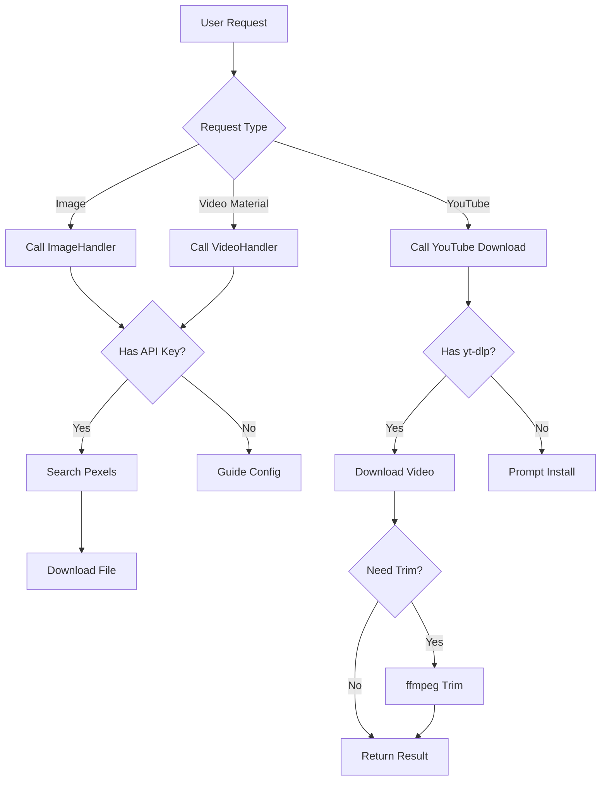

# 🎬 Media Downloader v2

> 📘 [Documentation](README.md) | 🇨🇳 [中文文档](README_CN.md)

Just tell me what you want, and I'll find and download relevant images and videos for you!

---

## 🚀 What can I do?

| You say... | I will... |
|------------|-----------|
| "Download some cute cat images" | Search and download 5 cat images |
| "Find a video of ocean waves, about 15s" | Download a 15s ocean wave video |
| "Download this YouTube video" | Download YouTube video |
| "Download YouTube video from 1:30 to 2:00" | Download and automatically trim the segment |

---

## 📋 Execution Logic



### API Key Configuration

1. **YouTube Download**: No API Key required, ready to use.
2. **Image/Video Search**: Requires Pexels API Key configuration on first use.

---

## 🛠️ CLI Commands

```bash
# Check status
python cli.py status

# Download images
python cli.py image "keyword" -n count

# Download video materials
python cli.py video "keyword" -d max_duration

# Download YouTube
python cli.py youtube "URL" --start 60 --end 90

# Search media
python cli.py search "keyword" --type video
```

---

## 📁 Download Location

Files are saved by default in the `downloads/` folder within the skill directory.

---

## 💡 Configure API Key

```bash
# Pexels (Free registration: https://www.pexels.com/api/)
export PEXELS_API_KEY="your_key"
```
